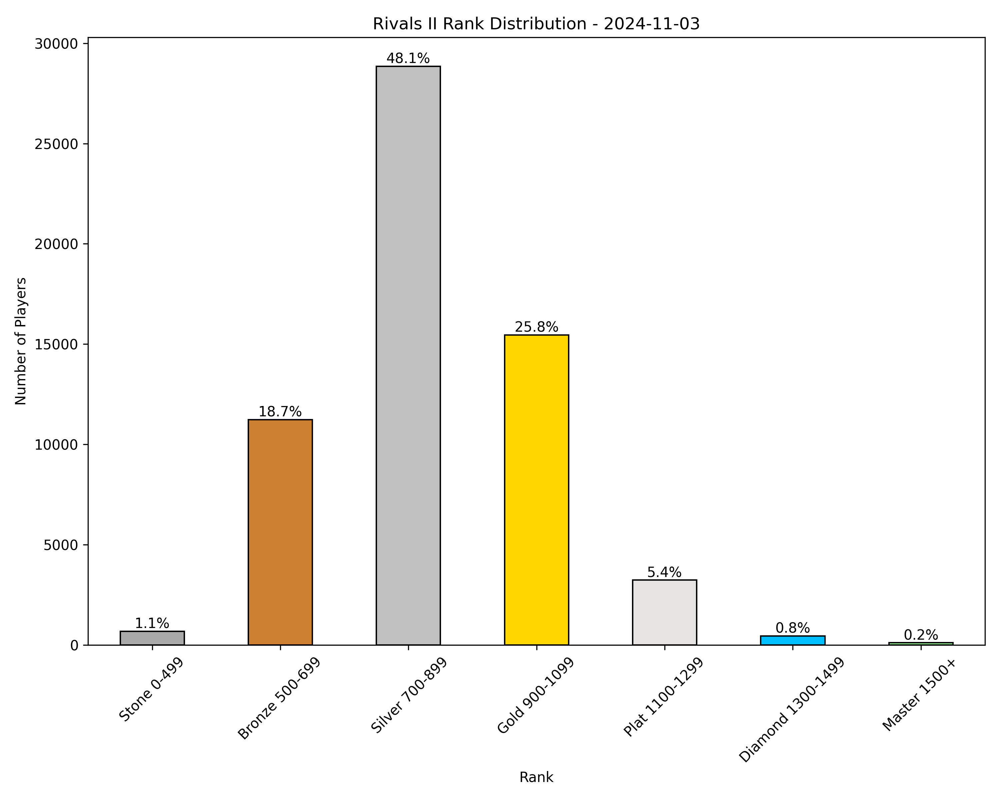

# Steam Leaderboard Stats

Quick script that uses steam's leaderboard [xml API](https://partner.steamgames.com/documentation/community_data). This api is deprecated, but it does not require any tokens to access.

# Rivals 2 Ranked Distribution

Using the leaderboard, and the ranked thresholds, we can create a visualization of the current leaderboard.




# How to run

Install pipenv and then:

```
pipenv install
pipenv run python ./main.py
```